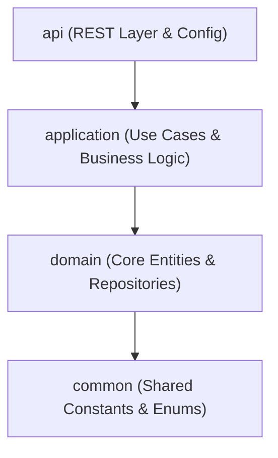

# TÀI LIỆU CẤU TRÚC THƯ MỤC CHI TIẾT — `vdbas-exp-be`

Tài liệu này mô tả chi tiết cấu trúc thư mục của dự án `vdbas-exp-be` (VDBAS Expenditure Backend), một hệ thống backend Spring Boot được xây dựng theo mô hình **Maven Multi-Module** và tuân thủ nguyên lý kiến trúc **DDD (Domain-Driven Design)** kết hợp **Clean Architecture**.

---

## 1. TỔNG QUAN VỀ KIẾN TRÚC DỰ ÁN

Dự án được phân chia thành 4 module chính với chiều phụ thuộc một chiều từ ngoài vào trong:



### Chiều phụ thuộc chi tiết:

- `api`: Phụ thuộc vào `application`. Chứa các REST Controller, cấu hình Security (JWT, Dynamic Authorization), i18n, Swagger và điểm chạy ứng dụng.
- `application`: Phụ thuộc vào `domain`. Chứa logic nghiệp vụ (Service), DTOs (Data Transfer Objects), cấu hình map nghiệp vụ (MapStruct Mapper), và các lớp xử lý ngoại lệ nghiệp vụ.
- `domain`: Phụ thuộc vào `common`. Chứa các thực thể JPA (Entities), giao diện truy vấn cơ sở dữ liệu (Repositories), cấu trúc bảng, và cơ chế Audit.
- `common`: Không phụ thuộc vào module nào. Chứa các Enum dùng chung (ví dụ: trạng thái hồ sơ, vai trò tác động), Converter cho JPA, hằng số cache, hằng số lỗi.

---

## 2. SƠ ĐỒ CẤU TRÚC THƯ MỤC TRỰC QUAN

Dưới đây là sơ đồ cây cấu trúc thư mục của dự án (đã lược bỏ các file biên dịch trung gian trong thư mục `target` và cấu hình IDE):

```text
vdbas-exp-be/
├── pom.xml                                   # File cấu hình Maven cha (Root POM)
├── Dockerfile                                # Định nghĩa Docker Image cho ứng dụng
├── docker-compose.yml                        # Cấu hình khởi chạy Container ứng dụng & Oracle DB
├── DOCKER.md                                 # Hướng dẫn chi tiết chạy Docker
├── README.md                                 # Tài liệu giới thiệu & Hướng dẫn nhanh dự án
│
├── common/                                   # MODULE COMMON: Thư viện & Hằng số dùng chung
│   ├── pom.xml
│   └── src/main/java/com/fis/vdbas/exp/common/
│       ├── CacheConstants.java               # Tên cache (Caffeine/Redis), mã cứng Workflow (CAPEX, OPEX)
│       ├── Constants.java                    # Định nghĩa mã lỗi (ErrorCode), MessageKey (i18n), tên Resource
│       ├── converter/
│       │   ├── ActionRoleConverter.java      # Chuyển đổi Enum ActionRole sang kiểu dữ liệu DB
│       │   └── DossierStatusConverter.java   # Chuyển đổi Enum DossierStatus sang kiểu dữ liệu DB
│       └── enums/
│           ├── ActionRole.java               # Định nghĩa các vai trò: MAKER, CHECKER, APPROVER
│           └── DossierStatus.java            # Trạng thái hồ sơ Union (CAPEX + OPEX)
│
├── domain/                                   # MODULE DOMAIN: Các Entity JPA và Spring Data JPA Repositories
│   ├── pom.xml
│   └── src/main/
│       ├── java/com/fis/vdbas/exp/domain/
│       │   ├── audit/                        # Nghiệp vụ Audit Log
│       │   │   ├── ExpAuditLog.java          # Thực thể lưu vết tác động của người dùng
│       │   │   └── ExpAuditLogRepository.java
│       │   ├── base/
│       │   │   └── ExpAuditing.java          # Base Entity lưu thông tin thời gian/người tạo/người cập nhật
│       │   ├── category/                     # Nghiệp vụ danh mục dùng chung
│       │   │   ├── CategoryGroup.java        # Nhóm danh mục (Ví dụ: Danh mục tiền tệ, nguồn vốn)
│       │   │   ├── CategoryGroupRepository.java
│       │   │   ├── Category.java             # Phần tử chi tiết trong nhóm danh mục
│       │   │   └── CategoryRepository.java
│       │   ├── dossier/                      # Nghiệp vụ cốt lõi: Hồ sơ thanh toán (Dossier)
│       │   │   ├── ExpApprovalLog.java       # Nhật ký phê duyệt hồ sơ (Approve, Checker Reject...)
│       │   │   ├── ExpApprovalLogRepository.java
│       │   │   ├── ExpDigitalSigned.java     # Thông tin chữ ký số trên hồ sơ
│       │   │   ├── ExpDocument.java          # Tài liệu đi kèm hồ sơ thanh toán
│       │   │   ├── ExpDocumentRepository.java
│       │   │   ├── ExpDossierAttachment.java # File đính kèm tài liệu
│       │   │   ├── ExpDossierAttachmentRepository.java
│       │   │   ├── ExpDossierDraft.java      # Bản nháp hồ sơ trước khi khởi tạo chính thức
│       │   │   ├── ExpDossierDraftRepository.java
│       │   │   ├── ExpDossier.java           # Thực thể Hồ sơ thanh toán chính (Dùng chung CAPEX & OPEX)
│       │   │   ├── ExpDossierRepository.java
│       │   │   ├── ExpDossierSla.java        # Cấu hình SLA xử lý hồ sơ
│       │   │   └── ExpDossierSlaRepository.java
│       │   └── lov/                          # Nghiệp vụ LOV (List of Values) dùng cho Dropdown
│       │       ├── CommonOrganization.java   # Đơn vị sử dụng ngân sách
│       │       ├── CommonOrganizationRepository.java
│       │       ├── CommonTreasury.java       # Kho bạc nhà nước gánh chịu thanh toán
│       │       ├── CommonTreasuryRepository.java
│       │       ├── ExpAttachmentType.java    # Loại tài liệu đính kèm
│       │       ├── ExpAttachmentTypeRepository.java
│       │       ├── ExpDataSource.java        # Nguồn dữ liệu
│       │       ├── ExpDataSourceRepository.java
│       │       ├── ExpDocumentType.java      # Loại tài liệu trong hồ sơ
│       │       ├── ExpDocumentTypeRepository.java
│       │       ├── ExpDossierType.java       # Loại hồ sơ thanh toán
│       │       ├── ExpDossierTypeRepository.java
│       │       ├── ExpProject.java           # Dự án đầu tư công
│       │       ├── ExpProjectRepository.java
│       │       ├── ExpProjectSpecific.java   # Tiểu dự án / Hợp phần đặc thù
│       │       ├── ExpProjectSpecificRepository.java
│       │       ├── ExpWorkflow.java          # Quy trình phê duyệt (Workflow)
│       │       └── ExpWorkflowRepository.java
│       └── resources/db/migration/
│           └── V1__init_payment.sql          # Script khởi tạo cấu trúc bảng Oracle DB
│
├── application/                              # MODULE APPLICATION: Logic nghiệp vụ, DTOs & Mappers
│   ├── pom.xml
│   └── src/
│       ├── main/java/com/fis/vdbas/exp/application/
│       │   ├── audit/                        # Logic nghiệp vụ Audit
│       │   │   ├── dto/AuditLogEntryDto.java
│       │   │   ├── mapper/AuditLogMapper.java
│       │   │   └── service/AuditLogService.java
│       │   ├── category/                     # Logic nghiệp vụ Quản lý Danh mục
│       │   │   ├── dto/                      # Chứa CategoryDto, CategoryGroupDto, CategorySearchDto...
│       │   │   ├── mapper/                   # Cấu hình MapStruct map giữa Entity <-> DTO
│       │   │   └── service/                  # CategoryService & CategoryGroupService
│       │   ├── dossier/                      # Logic nghiệp vụ Hồ sơ & Luồng phê duyệt (Maker-Checker-Approver)
│       │   │   ├── dto/                      # Các DTO gửi yêu cầu (ApproveRequest, DossierCreateRequest) và phản hồi
│       │   │   ├── mapper/                   # MapStruct cho hồ sơ (ví dụ: OpexDossierMapper)
│       │   │   └── service/
│       │   │       ├── AttachmentService.java        # Quản lý file đính kèm
│       │   │       ├── DocumentService.java          # Quản lý tài liệu
│       │   │       ├── DossierDraftService.java      # Lưu nháp hồ sơ
│       │   │       ├── DossierService.java           # Nghiệp vụ hồ sơ CAPEX (Chi đầu tư)
│       │   │       ├── DossierWorkflowService.java   # Luồng phê duyệt hồ sơ CAPEX
│       │   │       ├── OpexDocumentService.java      # Quản lý tài liệu hồ sơ OPEX (Chi thường xuyên)
│       │   │       ├── OpexDossierService.java       # Nghiệp vụ hồ sơ OPEX
│       │   │       └── OpexDossierWorkflowService.java# Quy trình Maker - Checker - Approver của OPEX
│       │   └── lov/                          # Logic nghiệp vụ List of Values
│       │       ├── dto/                      # DTO biểu diễn dữ liệu của LOV
│       │       ├── mapper/
│       │       └── service/LovService.java   # Service tập hợp lấy toàn bộ danh sách Dropdown
│       └── test/java/com/fis/vdbas/exp/application/dossier/
│           ├── mapper/OpexDossierMapperTest.java
│           └── service/
│               ├── OpexDossierServiceTest.java
│               └── OpexDossierWorkflowServiceTest.java
│
├── api/                                      # MODULE API: REST Controller & Entry Point
│   ├── pom.xml
│   └── src/
│       ├── main/
│       │   ├── java/com/fis/vdbas/exp/
│       │   │   ├── ExpApplication.java       # Hàm main khởi chạy ứng dụng Spring Boot
│       │   │   └── api/                      # Các lớp Controller tiếp nhận Request HTTP
│       │   │       ├── audit/
│       │   │       │   ├── AuditController.java
│       │   │       │   └── OpexAuditController.java
│       │   │       ├── category/
│       │   │       │   ├── CategoryController.java
│       │   │       │   └── CategoryGroupController.java
│       │   │       ├── dossier/          # Các đầu API tương tác hồ sơ & tiến trình chuyển đổi trạng thái
│       │   │       │   ├── AttachmentController.java
│       │   │       │   ├── DocumentController.java
│       │   │       │   ├── DossierController.java
│       │   │       │   ├── DossierDraftController.java
│       │   │       │   ├── OpexAttachmentController.java
│       │   │       │   ├── OpexDocumentController.java
│       │   │       │   ├── OpexDossierController.java
│       │   │       │   ├── OpexWorkflowController.java
│       │   │       │   └── WorkflowController.java
│       │   │       └── lov/
│       │   │           └── LovController.java
│       │   └── resources/
│       │       ├── application.yml           # Cấu hình chính (Datasource, JPA, Cache, CORS, Swagger)
│       │       ├── messages.properties       # Bản tin thông báo lỗi mặc định (Tiếng Việt)
│       │       ├── messages_vi.properties    # Bản tin Tiếng Việt
│       │       └── messages_en.properties    # Bản tin Tiếng Anh
│       └── test/java/com/fis/vdbas/exp/api/
│           ├── SeedDataTest.java             # Test tạo dữ liệu mẫu (LOV, Category) vào DB H2/Local
│           └── SeedRealDbTest.java           # Test nạp dữ liệu mẫu vào Oracle DB thật
│
├── docs/                                     # Tài liệu hoặc mã nguồn mẫu phục vụ học tập/kiểm thử
│   ├── docs.iml
│   └── src/
│       └── Main.java                         # Lớp Java cơ bản (Hello World của IntelliJ)
│
└── scriptTest/                               # Thư mục kiểm thử tự động (Integration Testing)
    ├── integration_test.py                   # Script Python kiểm thử tích hợp luồng CAPEX
    ├── opex_integration_test.py              # Script Python kiểm thử tích hợp luồng OPEX
    ├── opex_report.json                      # Kết quả kiểm thử luồng OPEX dạng JSON
    └── report.json                           # Kết quả kiểm thử luồng CAPEX dạng JSON
```

---

## 3. CHI TIẾT CHỨC NĂNG TỪNG THƯ MỤC

### 3.1. Thư mục `common` (Module Common)

Chứa các dữ liệu dùng chung, không thay đổi theo thời gian và mang tính chất định nghĩa nền tảng.

- `enums/`:
  - `DossierStatus.java`: Định nghĩa toàn bộ trạng thái mà hồ sơ có thể trải qua. Trạng thái từ `DRAFT` đến `COMPLETED` đại diện cho luồng chi đầu tư (CAPEX). Trạng thái từ `PENDING_CHECKER` đến `DELETED` phục vụ luồng chi thường xuyên (OPEX) theo chuẩn Maker-Checker-Approver.
  - `ActionRole.java`: Quyết định phân quyền trong luồng phê duyệt (`MAKER`, `CHECKER`, `APPROVER`).
- `converter/`:
  - `DossierStatusConverter.java` & `ActionRoleConverter.java`: Sử dụng `@Converter` của JPA để tự động chuyển đổi cấu trúc enum Java thành chuỗi/số lưu trực tiếp xuống cơ sở dữ liệu và ngược lại khi lấy lên.
- `Constants.java`:
  - `Resource`: Tên các tài nguyên để phân quyền động.
  - `ErrorCode` & `MessageKey`: Định nghĩa mã lỗi API (ví dụ: `VDBAS-EXP-0001` cho Hồ sơ không tồn tại) kết hợp khóa dịch ngôn ngữ.

### 3.2. Thư mục `domain` (Module Domain)

Nơi mô tả toàn bộ cấu trúc cơ sở dữ liệu và quy tắc nghiệp vụ lõi (Core Domain Rules).

- `dossier/`:
  - `ExpDossier.java`: Thực thể quan trọng nhất, lưu trữ các thông tin chung của hồ sơ thanh toán như mã hồ sơ (`dossierCode`), ngày gửi (`sendDate`), thông tin dự án, đơn vị thụ hưởng ngân sách, trạng thái nghiệp vụ (`fStatus`). Các thông tin từ danh mục LOV được *denormalize* (lưu trực tiếp tên/mã) để tránh tối đa việc join bảng phức tạp.
  - `ExpDocument.java`: Một hồ sơ có thể có nhiều chứng từ tài liệu đi kèm (ví dụ: Hóa đơn, quyết định phê duyệt).
  - `ExpDossierAttachment.java`: Các tệp tin vật lý đính kèm cho từng tài liệu.
  - `ExpApprovalLog.java`: Ghi lại lịch sử phê duyệt, từ chối, ý kiến phản hồi của các cấp phê duyệt.
- `lov/`:
  - Chứa các thực thể tĩnh (LOV) như kho bạc (`CommonTreasury`), dự án (`ExpProject`), loại hồ sơ (`ExpDossierType`) dùng để cung cấp dữ liệu cho các ô nhập liệu dạng Dropdown trên Frontend.
- `resources/db/migration/`:
  - `V1__init_payment.sql`: File SQL khởi tạo toàn bộ bảng, khóa ngoại, chỉ mục (index), và các chuỗi sequence cần thiết của dự án trên Oracle Database.

### 3.3. Thư mục `application` (Module Application)

Xử lý toàn bộ logic nghiệp vụ (Use Cases). Đóng vai trò cầu nối, biến đổi dữ liệu từ Request DTO sang Entity và ngược lại.

- `dossier/service/`:
  - `OpexDossierWorkflowService.java`: Điều phối luồng chuyển đổi trạng thái hồ sơ OPEX. Ví dụ: khi Maker nhấn Submit, trạng thái sẽ chuyển thành `PENDING_CHECKER`. Khi Checker chấp nhận, chuyển thành `CHECKED` và đẩy tiếp cho Approver.
  - `OpexDossierService.java`: Thực hiện CRUD hồ sơ OPEX, soft-delete hồ sơ bằng cách chuyển trạng thái `status = 0` và `fStatus = DELETED`.
- `dossier/mapper/`:
  - `OpexDossierMapper.java`: Cấu hình MapStruct giúp ánh xạ nhanh giữa các đối tượng phức tạp như `ExpDossier` sang `DossierDetailDto` hay `OpexDossierCreateRequest` mà không cần viết các đoạn mã set/get thủ công.

### 3.4. Thư mục `api` (Module API)

Tầng giao tiếp trực tiếp với môi trường ngoài (Web/Mobile App).

- `api/dossier/`:
  - `OpexDossierController.java`: Tiếp nhận các Request REST API liên quan đến hồ sơ OPEX như: Tạo nháp, tạo mới, cập nhật, lấy chi tiết, phân trang danh sách.
  - `OpexWorkflowController.java`: Tiếp nhận các lệnh thao tác luồng phê duyệt từ Client (Gửi duyệt, Checker phê duyệt/từ chối, Approver phê duyệt/tối).
- `resources/application.yml`:
  - Định cấu hình cổng chạy (`8080`), bật tắt Swagger (`springdoc`), cấu hình kết nối Oracle Database, cơ chế Cache (`Caffeine` cho môi trường phát triển và `Redis` cho production), cấu hình CORS để cho phép Frontend kết nối.
- `test/`:
  - `SeedRealDbTest.java`: Đoạn mã chạy kiểm thử hỗ trợ nạp tự động dữ liệu danh mục tĩnh (LOV) vào cơ sở dữ liệu Oracle để phục vụ quá trình test nhanh hệ thống.

### 3.5. Thư mục `scriptTest`

- `opex_integration_test.py` & `integration_test.py`: Các kịch bản test viết bằng Python gửi trực tiếp request HTTP lên các cổng API để giả lập toàn bộ vòng đời của một hồ sơ (từ lúc tạo nháp, cập nhật tài liệu, ký số, submit phê duyệt cho đến khi hoàn thành). Đây là công cụ đắc lực để đảm bảo chất lượng API (Integration Testing) trước khi triển khai (CI/CD).

---

## 4. HƯỚNG DẪN PHÁT TRIỂN TÍNH NĂNG MỚI DỰA TRÊN CẤU TRÚC THƯ MỤC

Khi bạn cần thêm một tính năng hoặc nghiệp vụ mới vào dự án (Ví dụ: Tính năng quản lý Hợp đồng - Contract), hãy thực hiện tuần tự theo cấu trúc thư mục như sau:

1. **Bước 1 (Common)**: Khai báo các hằng số lỗi trong `Constants.java` và định nghĩa Enum trạng thái hợp đồng (nếu có) trong thư mục `common/src/main/.../common/enums/`.
2. **Bước 2 (Domain)**: Tạo thực thể JPA `ExpContract.java` và repository `ExpContractRepository.java` tương ứng tại thư mục `domain/src/main/.../domain/contract/`.
3. **Bước 3 (Application)**:
   - Tạo các lớp DTO tiếp nhận yêu cầu (`ContractCreateRequest`, `ContractDto`) trong thư mục `application/.../contract/dto/`.
   - Tạo MapStruct mapper `ContractMapper.java` trong thư mục `application/.../contract/mapper/`.
   - Tạo service xử lý nghiệp vụ `ContractService.java` trong thư mục `application/.../contract/service/`.
4. **Bước 4 (API)**: Tạo lớp REST Controller `ContractController.java` trong thư mục `api/src/main/.../api/contract/` để mở các cổng API đón nhận Request.
5. **Bước 5 (Database Migration)**: Viết script SQL tạo bảng hợp đồng vào thư mục `domain/src/main/resources/db/migration/`.